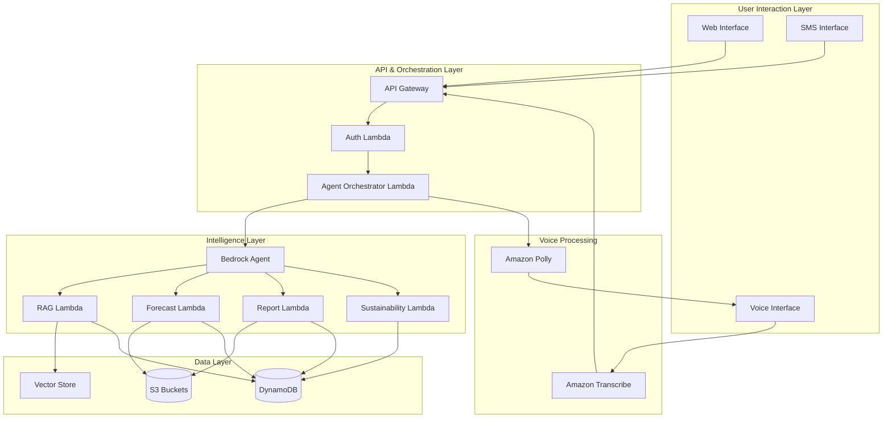

# Design Document: GramSaarthi

## Overview

GramSaarthi is implemented as a serverless, event-driven system on AWS, leveraging Amazon Bedrock for AI capabilities, Lambda for compute, API Gateway for HTTP interfaces, and DynamoDB for data persistence. The architecture follows a layered approach with clear separation between user interaction, orchestration, intelligence, and data layers.

The system uses Retrieval-Augmented Generation (RAG) to provide accurate scheme information, machine learning models for water stress forecasting, and Amazon Bedrock Agents for multi-step reasoning and orchestration. Voice and SMS interfaces provide accessibility for users with varying levels of digital literacy and connectivity.

All AI outputs are explicitly marked as advisory, with confidence scores and source citations to maintain human oversight in governance decisions.

## High-Level Architecture



## Component Design

### User Interaction Layer

#### Web Interface
- **Technology**: Static HTML/CSS/JavaScript hosted on S3 with CloudFront
- **Responsibilities**: 
  - Render user interface for query input and result display
  - Handle user authentication flow
  - Display forecasts, schemes, and recommendations
  - Provide report download functionality
- **Interface**: Communicates with API Gateway via HTTPS REST calls

#### Voice Interface
- **Technology**: Web-based audio capture with MediaRecorder API
- **Responsibilities**:
  - Capture audio input from user
  - Send audio to Amazon Transcribe via API Gateway
  - Receive text-to-speech audio from Amazon Polly
  - Play audio responses to user
- **Interface**: Sends audio blobs to `/voice/transcribe` endpoint, receives audio from `/voice/synthesize` endpoint

#### SMS Interface
- **Technology**: Amazon SNS for SMS sending, API Gateway for SMS webhook
- **Responsibilities**:
  - Receive SMS messages via webhook
  - Parse command keywords (FORECAST, SCHEME, HELP)
  - Format responses to fit SMS length constraints
  - Send responses via SNS
- **Interface**: Webhook endpoint `/sms/receive`, SNS topic for outbound messages

### API & Orchestration Layer

#### API Gateway
- **Configuration**: REST API with Lambda proxy integration
- **Endpoints**:
  - `POST /auth/login` - User authentication
  - `POST /query` - General query endpoint
  - `POST /forecast` - Water stress forecast request
  - `POST /schemes` - Scheme search request
  - `POST /report` - Report generation request
  - `POST /voice/transcribe` - Voice transcription
  - `GET /voice/synthesize` - Text-to-speech
  - `POST /sms/receive` - SMS webhook
- **Security**: API keys, IAM authorization, request throttling
- **CORS**: Enabled for web interface origin

#### Auth Lambda
- **Runtime**: Python 3.11
- **Responsibilities**:
  - Validate user credentials against DynamoDB user table
  - Generate JWT tokens with jurisdiction claims
  - Verify JWT tokens on subsequent requests
  - Implement session management
- **Input**: `{ "username": string, "password": string }` or `{ "token": string }`
- **Output**: `{ "token": string, "jurisdiction": string, "expiresAt": timestamp }` or `{ "valid": boolean }`
- **Error Handling**: Returns 401 for invalid credentials, 403 for expired tokens

#### Agent Orchestrator Lambda
- **Runtime**: Python 3.11
- **Responsibilities**:
  - Route requests to appropriate specialized Lambda functions
  - Invoke Amazon Bedrock Agent for complex multi-step queries
  - Aggregate results from multiple components
  - Manage conversation context
  - Handle parallel execution of independent tasks
- **Input**: `{ "query": string, "jurisdiction": string, "context": object }`
- **Output**: `{ "response": string, "sources": array, "confidence": float, "components": array }`
- **Integration**: Uses Bedrock Agent API with custom action groups

### Intelligence Layer

#### Amazon Bedrock Agent
- **Model**: Claude 3 Sonnet or Haiku (configurable)
- **Action Groups**:
  - `ForecastActions`: Invoke water stress forecasting
  - `SchemeActions`: Search and retrieve scheme information
  - `ReportActions`: Generate administrative reports
  - `SustainabilityActions`: Provide climate recommendations
- **Knowledge Base**: Connected to vector store for RAG
- **Prompt Template**: System prompt emphasizing advisory nature, source citation, and confidence scoring

#### RAG Lambda
- **Runtime**: Python 3.11
- **Responsibilities**:
  - Receive scheme queries from Bedrock Agent
  - Generate query embeddings using Bedrock Titan Embeddings
  - Search vector store for relevant scheme documents
  - Retrieve top-k matching schemes (k=5)
  - Format results with metadata (source, date, eligibility)
- **Input**: `{ "query": string, "filters": object, "topK": int }`
- **Output**: `{ "schemes": array, "scores": array, "sources": array }`
- **Vector Store**: Amazon OpenSearch Serverless or FAISS in S3
- **Embedding Model**: amazon.titan-embed-text-v1

#### Forecast Lambda
- **Runtime**: Python 3.11
- **Responsibilities**:
  - Load historical data for jurisdiction from S3
  - Run water stress prediction model
  - Generate 30-day forecast with confidence intervals
  - Identify high-risk periods based on thresholds
  - Cache results in DynamoDB
- **Input**: `{ "jurisdiction": string, "startDate": date }`
- **Output**: `{ "forecast": array, "confidence": array, "highRiskDays": array, "model": string }`
- **Model**: Time series forecasting (Prophet or ARIMA) trained on synthetic data
- **Data Sources**: S3 bucket with historical rainfall and groundwater CSV files

#### Report Lambda
- **Runtime**: Python 3.11
- **Responsibilities**:
  - Compile data from forecasts, schemes, and recommendations
  - Apply administrative report template
  - Generate PDF using ReportLab or WeasyPrint
  - Store report in S3 with jurisdiction-based key
  - Return presigned URL for download
- **Input**: `{ "jurisdiction": string, "reportType": string, "dateRange": object }`
- **Output**: `{ "reportUrl": string, "expiresAt": timestamp, "reportId": string }`
- **Templates**: Stored in S3, support for multiple report types (monthly, quarterly, annual)

#### Sustainability Lambda
- **Runtime**: Python 3.11
- **Responsibilities**:
  - Analyze water forecast and climate data
  - Generate sustainability recommendations using Bedrock
  - Link recommendations to relevant schemes via RAG
  - Provide actionable steps and priority levels
  - Mark all outputs as advisory
- **Input**: `{ "jurisdiction": string, "forecast": object, "context": object }`
- **Output**: `{ "recommendations": array, "linkedSchemes": array, "priority": string, "advisory": boolean }`
- **Prompt Engineering**: Uses few-shot examples for consistent recommendation format

### Data Layer

#### DynamoDB Tables

**Users Table**
- **Partition Key**: `userId` (string)
- **Attributes**: `username`, `passwordHash`, `jurisdiction`, `role`, `createdAt`
- **GSI**: `jurisdiction-index` for querying users by jurisdiction

**Forecasts Table**
- **Partition Key**: `jurisdiction` (string)
- **Sort Key**: `forecastDate` (string, ISO format)
- **Attributes**: `forecast` (list), `confidence` (list), `highRiskDays` (list), `model`, `generatedAt`
- **TTL**: `expiresAt` (30 days from generation)

**Schemes Table**
- **Partition Key**: `schemeId` (string)
- **Attributes**: `name`, `description`, `eligibility`, `applicationProcess`, `deadline`, `source`, `lastUpdated`, `embedding` (for vector search fallback)

**Reports Table**
- **Partition Key**: `jurisdiction` (string)
- **Sort Key**: `reportId` (string)
- **Attributes**: `reportType`, `dateRange`, `s3Key`, `generatedAt`, `downloadUrl`
- **TTL**: `expiresAt` (90 days from generation)

**Sessions Table**
- **Partition Key**: `sessionId` (string)
- **Attributes**: `userId`, `jurisdiction`, `context`, `createdAt`, `lastAccessedAt`
- **TTL**: `expiresAt` (24 hours from creation)

#### S3 Buckets

**Data Bucket** (`gramsaarthi-data-{env}`)
- **Purpose**: Store historical datasets, model artifacts, templates
- **Structure**:
  - `/historical/rainfall/{jurisdiction}.csv`
  - `/historical/groundwater/{jurisdiction}.csv`
  - `/models/forecast_model.pkl`
  - `/templates/report_monthly.html`
- **Access**: Lambda execution role with read-only access

**Reports Bucket** (`gramsaarthi-reports-{env}`)
- **Purpose**: Store generated reports
- **Structure**: `/reports/{jurisdiction}/{reportId}.pdf`
- **Access**: Presigned URLs with 7-day expiration
- **Lifecycle**: Delete objects after 90 days

**Vector Store**
- **Technology**: Amazon OpenSearch Serverless (vector engine) or FAISS index in S3
- **Dimensions**: 1536 (Titan Embeddings output)
- **Index**: HNSW for approximate nearest neighbor search
- **Documents**: ~5000 government scheme documents (synthetic/public)

### Voice Processing Layer

#### Amazon Transcribe Integration
- **Configuration**: Streaming transcription with real-time results
- **Language**: Hindi (hi-IN) and English (en-IN)
- **Custom Vocabulary**: Government scheme names, rural terminology
- **Output**: Transcription with confidence scores per word

#### Amazon Polly Integration
- **Voice**: Aditi (Hindi, female) or Raveena (English, female)
- **Format**: MP3 audio stream
- **SSML**: Used for emphasis on advisory disclaimers
- **Caching**: Frequently used phrases cached in S3

## Data Flow Description

### Query Flow (Text-Based)

1. User submits query via web interface
2. API Gateway receives request, validates API key
3. Auth Lambda verifies JWT token and extracts jurisdiction
4. Orchestrator Lambda receives authenticated request
5. Orchestrator invokes Bedrock Agent with query and context
6. Bedrock Agent analyzes query and determines required actions
7. Agent invokes appropriate action groups (RAG, Forecast, Sustainability)
8. Each Lambda executes its logic and returns results
9. Bedrock Agent synthesizes results into coherent response
10. Orchestrator adds advisory disclaimers and confidence scores
11. Response returned to user via API Gateway

### Voice Flow

1. User speaks query into web interface
2. Audio captured and sent to `/voice/transcribe` endpoint
3. API Gateway triggers Transcribe Lambda
4. Transcribe Lambda streams audio to Amazon Transcribe
5. Transcription result sent to Orchestrator Lambda (follows Query Flow)
6. Response text sent to Polly Lambda
7. Polly Lambda generates speech audio
8. Audio streamed back to user interface
9. User hears spoken response

### SMS Flow

1. User sends SMS to registered number
2. SMS provider webhook calls `/sms/receive` endpoint
3. SMS Lambda parses message and extracts command keyword
4. Lambda routes to appropriate component based on keyword
5. Component generates concise response (max 160 characters)
6. SMS Lambda sends response via SNS
7. User receives SMS reply

### Forecast Generation Flow

1. Forecast Lambda receives request with jurisdiction
2. Lambda checks DynamoDB cache for recent forecast
3. If cache miss, Lambda loads historical data from S3
4. Lambda runs forecasting model (Prophet/ARIMA)
5. Model generates 30-day predictions with confidence intervals
6. Lambda identifies high-risk days (stress > threshold)
7. Results stored in DynamoDB with TTL
8. Forecast returned to caller

### RAG Search Flow

1. RAG Lambda receives scheme query
2. Lambda generates query embedding using Bedrock Titan
3. Lambda searches vector store for top-5 similar documents
4. Lambda retrieves full scheme details from DynamoDB
5. Results ranked by similarity score
6. Metadata (source, date, eligibility) added to each result
7. Formatted results returned to Bedrock Agent

## Scalability Design

### Horizontal Scaling
- All Lambda functions configured with reserved concurrency limits
- API Gateway throttling: 1000 requests/second per jurisdiction
- DynamoDB on-demand capacity mode for automatic scaling
- OpenSearch Serverless auto-scales based on query load

### Caching Strategy
- Forecast results cached in DynamoDB for 24 hours
- Scheme embeddings pre-computed and stored
- Polly audio responses cached in S3 for common phrases
- CloudFront caching for static web assets (1 hour TTL)

### Cost Optimization
- Lambda functions use ARM64 architecture (Graviton2) for 20% cost savings
- Bedrock model selection: Haiku for simple queries, Sonnet for complex reasoning
- S3 Intelligent-Tiering for historical data
- DynamoDB TTL for automatic cleanup of expired data

### Load Distribution
- API Gateway regional deployment with Route 53 latency-based routing
- Lambda functions deployed across multiple availability zones
- DynamoDB global tables for multi-region deployment (future)

## Security & Responsible AI Considerations

### Authentication & Authorization
- JWT tokens with 24-hour expiration
- Jurisdiction-based access control enforced at Lambda layer
- API Gateway resource policies restrict access to known IPs (optional)
- Secrets Manager for storing credentials and API keys

### Data Protection
- TLS 1.2 minimum for all API communications
- DynamoDB encryption at rest using AWS KMS
- S3 bucket encryption with SSE-S3
- VPC endpoints for Lambda-to-AWS service communication (no internet)

### Responsible AI
- All AI outputs prefixed with "Advisory: This recommendation requires human review"
- Confidence scores displayed for all predictions and recommendations
- Source citations included for all scheme information
- Audit logs stored in CloudWatch Logs for 90 days
- No automated financial allocations or binding decisions
- Model cards documenting training data, limitations, and intended use

### Privacy
- No PII stored beyond session duration for voice/SMS
- User data isolated by jurisdiction (row-level security)
- Presigned URLs for reports expire after 7 days
- DynamoDB streams disabled to prevent data leakage

## Deployment Model

### Infrastructure as Code
- AWS CDK (Python) for infrastructure definition
- Separate stacks for data layer, compute layer, and API layer
- Environment-specific configuration (dev, staging, prod)

### CI/CD Pipeline
- GitHub Actions for automated testing and deployment
- Lambda deployment packages built with Docker for consistent dependencies
- Automated testing: unit tests, integration tests, load tests
- Blue-green deployment for zero-downtime updates

### Monitoring & Observability
- CloudWatch Logs for all Lambda functions
- CloudWatch Metrics for API Gateway, Lambda, DynamoDB
- X-Ray tracing for distributed request tracking
- CloudWatch Alarms for error rates, latency, and throttling
- Dashboard showing key metrics: requests/min, p99 latency, error rate

### Disaster Recovery
- DynamoDB point-in-time recovery enabled
- S3 versioning enabled for data and reports buckets
- Lambda function versions and aliases for rollback
- Automated backups of vector store daily
- RTO: 4 hours, RPO: 24 hours


## Correctness Properties

A property is a characteristic or behavior that should hold true across all valid executions of a system—essentially, a formal statement about what the system should do. Properties serve as the bridge between human-readable specifications and machine-verifiable correctness guarantees.

### Property 1: Valid Authentication Grants Access
*For any* valid user credentials (username and password combination that exists in the Users table), when authentication is attempted, the system should return a valid JWT token with jurisdiction claims and grant access to the system.
**Validates: Requirements 1.1**

### Property 2: Jurisdiction-Based Access Control
*For any* authenticated user, when accessing data, the system should only return data belonging to that user's assigned jurisdiction and deny access to data from other jurisdictions.
**Validates: Requirements 1.2, 11.3**

### Property 3: Invalid Authentication Denial and Logging
*For any* invalid credentials (username/password combination not in the Users table or incorrect password), when authentication is attempted, the system should deny access and create a log entry recording the failed attempt.
**Validates: Requirements 1.3**

### Property 4: Session Token Validation
*For any* session token, when used to access the system, the token should be validated for expiration and signature, and expired or invalid tokens should be rejected.
**Validates: Requirements 1.4**

### Property 5: Forecast Length Consistency
*For any* water stress forecast request, the generated forecast should contain exactly 30 daily predictions with corresponding dates.
**Validates: Requirements 2.1**

### Property 6: High-Risk Period Flagging
*For any* forecast data, when water stress values exceed the critical threshold (defined in system configuration), those days should be flagged as high-risk periods in the output.
**Validates: Requirements 2.3**

### Property 7: Confidence Intervals Presence
*For any* forecast prediction, the output should include confidence interval bounds (lower and upper) for that prediction.
**Validates: Requirements 2.4**

### Property 8: Scheme Metadata Completeness
*For any* scheme returned by the RAG engine, the output should include eligibility criteria, application process, deadlines, source document, and last update date.
**Validates: Requirements 3.2, 3.5**

### Property 9: Recommendation Actionability
*For any* sustainability recommendation generated, the output should include at least one actionable step describing what the user should do.
**Validates: Requirements 4.3**

### Property 10: Scheme Linking in Recommendations
*For any* sustainability recommendation that mentions a government scheme, the output should include a link or reference to that scheme's detailed information.
**Validates: Requirements 4.4**

### Property 11: Advisory Disclaimer Presence
*For any* AI-generated output (forecasts, recommendations, scheme suggestions), the response should include an advisory disclaimer stating that the output requires human review and approval.
**Validates: Requirements 4.5, 13.1, 13.2**

### Property 12: Report Data Source Inclusion
*For any* generated report, the report should include sections for forecasts, schemes, and recommendations (when applicable to the report type).
**Validates: Requirements 5.1**

### Property 13: Report Metadata Completeness
*For any* information included in a generated report, that information should have associated metadata including timestamp, data source, and confidence level (where applicable).
**Validates: Requirements 5.3, 13.3**

### Property 14: Report Storage Location
*For any* generated report, after generation completes, the report file should exist in the S3 reports bucket under the path `/reports/{jurisdiction}/{reportId}.pdf`.
**Validates: Requirements 5.4**

### Property 15: Voice Transcription Processing
*For any* audio input submitted to the voice interface, the system should produce a text transcription and process it through the query pipeline to generate a response.
**Validates: Requirements 6.1, 6.2**

### Property 16: Text-to-Speech Conversion
*For any* text response generated for a voice query, the system should convert it to audio using Amazon Polly and return the audio stream.
**Validates: Requirements 6.3**

### Property 17: SMS Response Length Constraint
*For any* SMS query response, the response text should be 160 characters or fewer to fit within SMS length limits.
**Validates: Requirements 7.2**

### Property 18: SMS Command Routing
*For any* SMS message containing a recognized command keyword (FORECAST, SCHEME, REPORT, HELP), the system should route the request to the corresponding component (Forecast Lambda, RAG Lambda, Report Lambda, or help handler).
**Validates: Requirements 7.1**

### Property 19: Ambiguous SMS Clarification
*For any* SMS query that matches multiple possible intents or lacks required parameters, the system should respond with a clarification request including numbered options.
**Validates: Requirements 7.4**

### Property 20: SMS Interaction Logging
*For any* SMS interaction (inbound or outbound), the system should create a log entry containing the message content, timestamp, user identifier, and processing result.
**Validates: Requirements 7.5**

### Property 21: Multi-Component Query Orchestration
*For any* query that requires data from multiple components (e.g., forecast + schemes + recommendations), the orchestrator should invoke all necessary components and include results from each in the final response.
**Validates: Requirements 8.1**

### Property 22: Context Preservation Across Turns
*For any* multi-turn conversation, when a follow-up query references previous context (e.g., "What about next month?"), the system should maintain the conversation context and interpret the query correctly.
**Validates: Requirements 8.2**

### Property 23: Graceful Agent Failure Handling
*For any* orchestrated query where one agent fails, the orchestrator should return a partial response with data from successful agents and include an error message about the failed component.
**Validates: Requirements 8.4**

### Property 24: Audit Logging Completeness
*For any* system operation (authentication, query processing, report generation, AI interaction), the system should create a log entry with timestamp, user identifier, operation type, and result status.
**Validates: Requirements 11.4, 13.5**

### Property 25: PII Deletion After Session
*For any* voice or SMS interaction containing personally identifiable information, when the session expires or ends, the PII should be deleted from all storage systems.
**Validates: Requirements 11.5**

### Property 26: Retry with Exponential Backoff
*For any* transient failure (network timeout, service unavailable), the system should retry the operation with exponentially increasing delays (e.g., 1s, 2s, 4s, 8s) up to a maximum number of attempts.
**Validates: Requirements 12.2**

### Property 27: User-Friendly Error Messages
*For any* error condition, the system should return an error response that includes a user-friendly message explaining what went wrong and what the user can do (not just technical error codes).
**Validates: Requirements 12.4**

## Error Handling

### Authentication Errors
- Invalid credentials: Return 401 with message "Invalid username or password"
- Expired token: Return 403 with message "Session expired, please log in again"
- Missing token: Return 401 with message "Authentication required"

### Data Errors
- Missing forecast data: Return 404 with message "Forecast data not available for this jurisdiction"
- Invalid jurisdiction: Return 400 with message "Invalid jurisdiction identifier"
- Scheme not found: Return 404 with message "No schemes found matching your query"

### Service Errors
- Bedrock timeout: Retry up to 3 times with exponential backoff, then return 503 with message "AI service temporarily unavailable, please try again"
- DynamoDB throttling: Implement exponential backoff retry, return 429 if still failing
- S3 access error: Return 500 with message "Unable to access data storage"

### Voice/SMS Errors
- Transcription failure: Return message "Unable to understand audio, please try again"
- Poor audio quality: Return message "Audio quality too low, please speak clearly"
- SMS too long: Truncate response and add "... (reply MORE for full response)"
- Invalid SMS command: Return message "Unknown command. Reply HELP for available commands"

### Validation Errors
- Missing required parameters: Return 400 with message listing missing fields
- Invalid date format: Return 400 with message "Invalid date format, use YYYY-MM-DD"
- Invalid report type: Return 400 with message "Report type must be monthly, quarterly, or annual"

## Testing Strategy

### Dual Testing Approach

The testing strategy employs both unit tests and property-based tests as complementary approaches:

**Unit Tests** focus on:
- Specific examples demonstrating correct behavior
- Edge cases (empty inputs, boundary values, special characters)
- Error conditions and exception handling
- Integration points between components
- Specific scenarios from requirements (e.g., "FORECAST" SMS command routing)

**Property-Based Tests** focus on:
- Universal properties that hold for all inputs
- Comprehensive input coverage through randomization
- Invariants that must be preserved
- Round-trip properties (e.g., serialize/deserialize)
- Metamorphic properties (relationships between inputs and outputs)

Together, these approaches provide comprehensive coverage: unit tests catch concrete bugs in specific scenarios, while property tests verify general correctness across the input space.

### Property-Based Testing Configuration

**Library Selection:**
- Python: Hypothesis (https://hypothesis.readthedocs.io/)
- TypeScript/JavaScript: fast-check (https://fast-check.dev/)

**Test Configuration:**
- Minimum 100 iterations per property test (due to randomization)
- Each property test must reference its design document property
- Tag format: `# Feature: gram-saarthi, Property {number}: {property_text}`

**Example Property Test Structure (Python with Hypothesis):**

```python
from hypothesis import given, strategies as st
import pytest

# Feature: gram-saarthi, Property 5: Forecast Length Consistency
@given(jurisdiction=st.text(min_size=1, max_size=50))
def test_forecast_length_consistency(jurisdiction):
    """For any forecast request, output should contain exactly 30 daily predictions"""
    forecast = generate_forecast(jurisdiction)
    assert len(forecast['predictions']) == 30
    assert all('date' in pred for pred in forecast['predictions'])
```

**Property Test Coverage:**
- Each correctness property (1-27) must be implemented as a property-based test
- Properties marked as "edge-case" in prework should be handled by generators
- Properties marked as "example" should be unit tests, not property tests

### Unit Testing Strategy

**Test Organization:**
- Tests organized by component (auth, forecast, rag, report, voice, sms, orchestrator)
- Each Lambda function has corresponding test file
- Integration tests for end-to-end flows

**Coverage Targets:**
- Minimum 80% code coverage for all Lambda functions
- 100% coverage for critical paths (authentication, data access control)
- All error handling paths must have explicit tests

**Example Unit Test Structure:**

```python
def test_invalid_credentials_denied():
    """Test that invalid credentials result in access denial"""
    response = authenticate("invalid_user", "wrong_password")
    assert response['status'] == 401
    assert 'Invalid username or password' in response['message']
    assert log_contains_failed_attempt("invalid_user")
```

### Integration Testing

**Test Scenarios:**
- End-to-end query flow: Web UI → API Gateway → Auth → Orchestrator → RAG → Response
- Voice flow: Audio input → Transcribe → Query processing → Polly → Audio output
- SMS flow: SMS webhook → Parse → Route → Process → SNS response
- Report generation: Request → Compile data → Generate PDF → Store S3 → Return URL

**Test Data:**
- Synthetic datasets for historical rainfall and groundwater
- Mock scheme documents (100 samples) for RAG testing
- Test user accounts with different jurisdictions
- Sample audio files for voice testing

### Load Testing

**Scenarios:**
- Baseline: 100 concurrent users, 1000 requests/minute
- Peak: 1000 concurrent users, 10000 requests/minute
- Sustained: 500 concurrent users for 1 hour

**Metrics:**
- p50, p95, p99 latency for each endpoint
- Error rate (target: <1%)
- Throttling rate
- Lambda cold start frequency

### Continuous Testing

**Pre-commit:**
- Unit tests for changed files
- Linting and code formatting

**CI Pipeline:**
- All unit tests
- All property-based tests (100 iterations each)
- Integration tests
- Code coverage report

**Pre-deployment:**
- Full test suite
- Load testing against staging environment
- Security scanning (SAST, dependency vulnerabilities)

### Test Data Management

**Synthetic Data Generation:**
- Rainfall data: Random time series with seasonal patterns
- Groundwater data: Correlated with rainfall with lag
- Scheme documents: Template-based generation with variations
- User accounts: Programmatically generated with different jurisdictions

**Data Refresh:**
- Test data regenerated weekly to catch data-dependent bugs
- Property test seeds rotated to explore different input spaces
