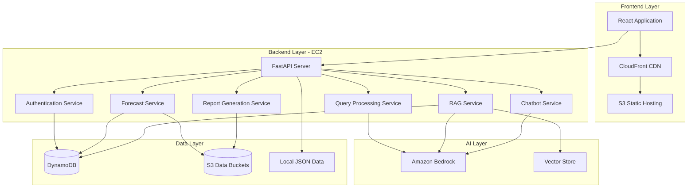

# Design Document: GramSaarthi

## Overview

GramSaarthi is implemented as a modern web application with a Python FastAPI backend hosted on AWS EC2 and a React frontend served via CloudFront and S3. The system leverages Amazon Bedrock for AI capabilities and DynamoDB for data persistence. The architecture follows a layered approach with clear separation between user interaction, business logic, intelligence, and data layers.

The system features persona-based access control with three user types: District Admin, Panchayat Officer, and Rural User. Each persona has access to specific pages and features tailored to their role. The application uses Indian-themed UI with a bright, accessible design suitable for rural users.

The system uses Retrieval-Augmented Generation (RAG) to provide accurate scheme information, machine learning models for water stress forecasting, and Amazon Bedrock for multi-step reasoning. The platform supports local development with cloud deployment for production.

All AI outputs are explicitly marked as advisory, with confidence scores and source citations to maintain human oversight in governance decisions.

## High-Level Architecture


```mermaid
graph TB
    subgraph "Frontend Layer"
        React[React Application]
        CloudFront[CloudFront CDN]
        S3Frontend[S3 Static Hosting]
    end
    
    subgraph "Backend Layer - EC2"
        FastAPI[FastAPI Server]
        AuthService[Authentication Service]
        QueryService[Query Processing Service]
        ReportService[Report Generation Service]
        ForecastService[Forecast Service]
        RAGService[RAG Service]
        ChatbotService[Chatbot Service]
    end
    
    subgraph "AI Layer"
        Bedrock[Amazon Bedrock]
        VectorDB[Vector Store]
    end
    
    subgraph "Data Layer"
        DDB[(DynamoDB)]
        S3Data[(S3 Data Buckets)]
        LocalData[Local JSON Data]
    end
    
    React --> CloudFront
    CloudFront --> S3Frontend
    React --> FastAPI
    
    FastAPI --> AuthService
    FastAPI --> QueryService
    FastAPI --> ReportService
    FastAPI --> ForecastService
    FastAPI --> RAGService
    FastAPI --> ChatbotService
    
    QueryService --> Bedrock
    RAGService --> Bedrock
    RAGService --> VectorDB
    ChatbotService --> Bedrock
    
    AuthService --> DDB
    ForecastService --> DDB
    ForecastService --> S3Data
    ReportService --> S3Data
    RAGService --> DDB
    
    FastAPI --> LocalData
```

## Component Design

### Frontend Layer

#### React Application
- **Technology**: React 18+ with TypeScript, Vite for build tooling
- **UI Framework**: Material-UI or Ant Design with Indian theme customization
- **Styling**: Bright, accessible color scheme suitable for rural users
- **State Management**: React Context API or Redux for global state
- **Routing**: React Router for page navigation
- **Responsibilities**: 
  - Render persona-specific pages and navigation
  - Handle user authentication flow (Login/Register)
  - Display navbar with village/mandal name after login
  - Manage form inputs for location selection (State → Mandal → Village)
  - Display reports, dashboards, and chatbot interface
  - Handle file uploads for District Admin ingest page
- **Pages by Persona**:
  - **District Admin**: Report page, Ingest page, Dashboard, Schemes Dashboard
  - **Panchayat Officer**: Report page, Dashboard, Schemes Dashboard
  - **Rural User**: Report page, Dashboard
- **Interface**: Communicates with FastAPI backend via REST API calls

#### CloudFront + S3 Static Hosting
- **Purpose**: Serve React application with global CDN distribution
- **Configuration**: 
  - S3 bucket configured for static website hosting
  - CloudFront distribution with S3 as origin
  - HTTPS enforced with ACM certificate
  - Caching strategy: index.html no-cache, assets with versioned URLs cached
- **Benefits**: Low latency, high availability, cost-effective for static content

### Backend Layer (EC2 + FastAPI)

#### FastAPI Server
- **Technology**: Python 3.11+, FastAPI framework, Uvicorn ASGI server
- **Deployment**: AWS EC2 instance (t3.medium or similar)
- **Process Management**: Systemd service or Supervisor for auto-restart
- **Reverse Proxy**: Nginx for SSL termination and load balancing
- **CORS**: Configured to allow requests from CloudFront domain
- **API Documentation**: Auto-generated Swagger UI at `/docs`
- **Endpoints**:
  - `POST /api/auth/register` - User registration
  - `POST /api/auth/login` - User authentication
  - `GET /api/auth/me` - Get current user info
  - `POST /api/query` - General chatbot query
  - `GET /api/reports` - List generated reports
  - `POST /api/reports/generate` - Generate new report
  - `POST /api/ingest` - Upload files (District Admin only)
  - `GET /api/dashboard/rainfall` - Get rainfall data
  - `GET /api/dashboard/district` - Get district details
  - `GET /api/schemes` - Get available schemes
  - `GET /api/locations/states` - Get list of states
  - `GET /api/locations/mandals/{state}` - Get mandals for state
  - `GET /api/locations/villages/{mandal}` - Get villages for mandal

#### Authentication Service
- **Responsibilities**:
  - Handle user registration with persona selection
  - Validate credentials against DynamoDB users table
  - Generate JWT tokens with persona and location claims
  - Verify JWT tokens on protected endpoints
  - Implement role-based access control (RBAC)
  - Load location data from `resources/telangana_all_villages.json`
- **User Model**:
  ```python
  {
    "gmail": "user@example.com",  # Primary key
    "password_hash": "bcrypt_hash",
    "name": "User Name",
    "persona": "District Admin | Panchayat Officer | Rural User",
    "state": "Telangana",
    "district": "Hyderabad",  # For District Admin
    "mandal": "Secunderabad",  # For Panchayat Officer and Rural User
    "village": "Village Name",  # For Panchayat Officer and Rural User
    "created_at": "2024-01-01T00:00:00Z"
  }
  ```
- **JWT Claims**: `{ "gmail": str, "persona": str, "district": str, "mandal": str, "village": str }`
- **Location Selection Logic**:
  - District Admin: Select only district (no mandal/village)
  - Panchayat Officer & Rural User: Select state → mandal → village (cascading dropdowns)

#### Query Processing Service
- **Responsibilities**:
  - Receive user queries from chatbot interface
  - Route queries to appropriate backend services
  - Invoke Amazon Bedrock for natural language understanding
  - Aggregate results from multiple services
  - Return formatted responses with sources
- **Integration**: Coordinates between RAG, Forecast, and Report services

#### Report Service
- **Responsibilities**:
  - Generate administrative reports based on user persona and location
  - Compile data from forecasts, schemes, and recommendations
  - Apply report templates (PDF generation)
  - Store reports in S3 with location-based keys
  - Return presigned URLs for download
  - List previously generated reports for user's location
- **Report Types**: Monthly, quarterly, annual summaries

#### Forecast Service
- **Responsibilities**:
  - Load historical rainfall and groundwater data
  - Run water stress prediction models
  - Generate 30-day forecasts with confidence intervals
  - Identify high-risk periods
  - Cache results in DynamoDB
  - Provide data for dashboard rainfall visualization
- **Model**: Time series forecasting (Prophet or ARIMA)

#### RAG Service
- **Responsibilities**:
  - Process scheme-related queries
  - Generate query embeddings using Bedrock Titan
  - Search vector store for relevant schemes
  - Retrieve scheme details from DynamoDB
  - Rank results by relevance
  - Format responses with metadata
- **Vector Store**: FAISS or Amazon OpenSearch Serverless

#### Chatbot Service
- **Responsibilities**:
  - Handle conversational queries from report page
  - Maintain conversation context per user session
  - Generate responses using Amazon Bedrock
  - Provide scheme recommendations
  - Answer questions about generated reports
  - Support follow-up questions with context awareness
- **Context Management**: Store conversation history in memory or DynamoDB

### AI Layer

#### Amazon Bedrock Integration
- **Model**: Claude 3 Sonnet or Haiku (configurable)
- **Use Cases**:
  - Natural language query understanding
  - Scheme recommendation generation
  - Report summarization
  - Chatbot conversation
  - Sustainability recommendations
- **Prompt Engineering**: System prompts emphasizing advisory nature and source citation

#### Vector Store
- **Technology**: FAISS (local/S3) or Amazon OpenSearch Serverless
- **Dimensions**: 1536 (Titan Embeddings output)
- **Index**: HNSW for approximate nearest neighbor search
- **Documents**: Government scheme documents (synthetic/public data)

### Data Layer

#### DynamoDB Tables

**Users Table**
- **Partition Key**: `gmail` (string)
- **Attributes**: `password_hash`, `name`, `persona`, `state`, `district`, `mandal`, `village`, `created_at`
- **GSI**: `persona-index` for querying users by persona
- **GSI**: `district-index` for querying users by district

**Forecasts Table**
- **Partition Key**: `location_key` (string, format: `{district}#{mandal}#{village}`)
- **Sort Key**: `forecast_date` (string, ISO format)
- **Attributes**: `forecast` (list), `confidence` (list), `high_risk_days` (list), `model`, `generated_at`
- **TTL**: `expires_at` (30 days from generation)

**Schemes Table**
- **Partition Key**: `scheme_id` (string)
- **Attributes**: `name`, `description`, `eligibility`, `application_process`, `deadline`, `source`, `last_updated`, `category`

**Reports Table**
- **Partition Key**: `location_key` (string)
- **Sort Key**: `report_id` (string)
- **Attributes**: `report_type`, `date_range`, `s3_key`, `generated_at`, `generated_by`, `download_url`
- **TTL**: `expires_at` (90 days from generation)

**ChatSessions Table**
- **Partition Key**: `session_id` (string)
- **Attributes**: `user_gmail`, `location_key`, `messages` (list), `created_at`, `last_accessed_at`
- **TTL**: `expires_at` (24 hours from creation)

#### S3 Buckets

**Frontend Bucket** (`gramsaarthi-frontend-{env}`)
- **Purpose**: Host React application static files
- **Structure**: `/index.html`, `/assets/*`, `/static/*`
- **Access**: Public read via CloudFront

**Data Bucket** (`gramsaarthi-data-{env}`)
- **Purpose**: Store historical datasets, model artifacts, templates
- **Structure**:
  - `/historical/rainfall/{district}/{mandal}.csv`
  - `/historical/groundwater/{district}/{mandal}.csv`
  - `/models/forecast_model.pkl`
  - `/templates/report_template.html`
  - `/uploads/{district}/` (for District Admin file uploads)
- **Access**: EC2 instance role with read/write access

**Reports Bucket** (`gramsaarthi-reports-{env}`)
- **Purpose**: Store generated reports
- **Structure**: `/reports/{district}/{mandal}/{village}/{report_id}.pdf`
- **Access**: Presigned URLs with 7-day expiration
- **Lifecycle**: Delete objects after 90 days

#### Local JSON Data

**Location Data** (`resources/telangana_all_villages.json`)
- **Purpose**: District-mandal-village mapping for Telangana
- **Structure**:
  ```json
  {
    "Telangana": {
      "districts": [
        {
          "name": "Hyderabad",
          "mandals": [
            {
              "name": "Secunderabad",
              "villages": ["Village1", "Village2", ...]
            }
          ]
        }
      ]
    }
  }
  ```
- **Usage**: Loaded at startup, cached in memory for fast access

## Data Flow Description

### User Registration Flow

1. User navigates to Register page in React app
2. User fills form: Gmail, Password, Name, Persona (dropdown)
3. Based on persona selection:
   - **District Admin**: Select State → District only
   - **Panchayat Officer/Rural User**: Select State → Mandal → Village (cascading dropdowns)
4. React app loads location data from FastAPI `/api/locations/*` endpoints
5. User submits registration form
6. React app sends POST request to `/api/auth/register`
7. FastAPI Authentication Service validates input
8. Service checks if Gmail already exists in DynamoDB Users table
9. If unique, service hashes password with bcrypt
10. Service stores user record in DynamoDB with persona and location data
11. Service returns success response
12. React app redirects to Login page

### User Login Flow

1. User navigates to Login page in React app
2. User enters Gmail and Password
3. React app sends POST request to `/api/auth/login`
4. FastAPI Authentication Service validates credentials against DynamoDB
5. If valid, service generates JWT token with claims (gmail, persona, district, mandal, village)
6. Service returns JWT token and user info
7. React app stores token in localStorage
8. React app redirects to appropriate landing page based on persona
9. Navbar displays village/mandal name from user data

### Query Flow (Chatbot on Report Page)

1. User types question in chatbot interface on Report page
2. React app sends POST request to `/api/query` with JWT token and query text
3. FastAPI verifies JWT token and extracts user context
4. Query Processing Service receives authenticated request
5. Service invokes Amazon Bedrock with query and user context
6. Bedrock analyzes query and determines required information
7. Service routes to appropriate backend services:
   - Scheme queries → RAG Service
   - Forecast queries → Forecast Service
   - Report queries → Report Service
8. Each service executes its logic and returns results
9. Query Processing Service aggregates results
10. Service adds advisory disclaimers and confidence scores
11. Response returned to React app
12. Chatbot displays formatted response with sources

### Dashboard Data Flow

1. User navigates to Dashboard page
2. React app sends GET request to `/api/dashboard/rainfall` with JWT token
3. FastAPI verifies JWT and extracts user's location (district/mandal/village)
4. Forecast Service retrieves rainfall data for user's location from DynamoDB
5. If cache miss, service loads historical data from S3
6. Service returns rainfall time series data
7. React app renders rainfall visualization chart
8. Simultaneously, React app requests `/api/dashboard/district` for district details
9. Service compiles district-level statistics
10. React app displays district information cards

### Report Generation Flow

1. User clicks "Generate Report" button on Report page
2. React app shows report type selection modal (monthly/quarterly/annual)
3. User selects report type and date range
4. React app sends POST request to `/api/reports/generate` with JWT token
5. FastAPI verifies JWT and checks user persona permissions
6. Report Service receives request with user's location context
7. Service compiles data:
   - Fetches forecasts from Forecast Service
   - Fetches relevant schemes from RAG Service
   - Fetches recommendations from Query Service
8. Service applies HTML template for selected report type
9. Service generates PDF using WeasyPrint or ReportLab
10. Service stores PDF in S3 at `/reports/{district}/{mandal}/{village}/{report_id}.pdf`
11. Service creates presigned URL (7-day expiration)
12. Service stores report metadata in DynamoDB Reports table
13. Service returns report URL and metadata
14. React app displays download link and adds report to list

### File Ingest Flow (District Admin Only)

1. District Admin navigates to Ingest page
2. React app checks user persona from JWT token
3. If not District Admin, redirect to unauthorized page
4. Admin selects file type (CSV, PDF, Excel, etc.)
5. Admin uploads file via drag-and-drop or file picker
6. React app sends POST request to `/api/ingest` with file and JWT token
7. FastAPI verifies JWT and checks persona is District Admin
8. Ingest Service validates file format and size
9. Service stores file in S3 at `/uploads/{district}/{filename}`
10. Service processes file based on type:
    - CSV: Parse and store in DynamoDB
    - PDF: Extract text and create embeddings for RAG
    - Excel: Convert to CSV and process
11. Service returns processing status and file metadata
12. React app displays success message and file list

### Schemes Dashboard Flow

1. User navigates to Schemes Dashboard page
2. React app sends GET request to `/api/schemes` with JWT token
3. FastAPI verifies JWT and extracts user's location
4. RAG Service retrieves schemes relevant to user's location from DynamoDB
5. Service filters schemes by eligibility criteria matching user's context
6. Service ranks schemes by relevance and deadline proximity
7. Service returns list of schemes with metadata
8. React app displays schemes in card layout with:
   - Scheme name and description
   - Eligibility criteria
   - Application deadline
   - Application process link
9. User can click scheme card to view full details
10. User can use search/filter to find specific schemes

## Scalability Design

### Horizontal Scaling
- EC2 instance can be placed behind Application Load Balancer (ALB) for horizontal scaling
- Multiple EC2 instances in Auto Scaling Group for high availability
- DynamoDB on-demand capacity mode for automatic scaling
- CloudFront CDN for frontend reduces load on origin

### Vertical Scaling
- EC2 instance type can be upgraded (t3.medium → t3.large → t3.xlarge) based on load
- FastAPI with Uvicorn workers configured based on CPU cores
- Connection pooling for DynamoDB and S3 clients

### Caching Strategy
- Forecast results cached in DynamoDB for 24 hours
- Scheme embeddings pre-computed and stored
- Location data (telangana_all_villages.json) loaded at startup and cached in memory
- CloudFront caching for React static assets (1 hour TTL)
- FastAPI response caching for frequently accessed endpoints

### Cost Optimization
- Single EC2 instance for development, scale to multiple instances for production
- DynamoDB on-demand pricing for variable workloads
- S3 Intelligent-Tiering for historical data
- DynamoDB TTL for automatic cleanup of expired data
- CloudFront free tier covers most static asset delivery

### Load Distribution
- Application Load Balancer distributes traffic across multiple EC2 instances
- DynamoDB handles high-throughput reads/writes automatically
- S3 provides unlimited scalability for file storage
- Bedrock API handles concurrent requests with built-in rate limiting

## Security & Responsible AI Considerations

### Authentication & Authorization
- JWT tokens with 24-hour expiration
- Bcrypt password hashing with salt
- Persona-based access control enforced at FastAPI route level
- Gmail as unique identifier (primary key in DynamoDB)
- Protected routes require valid JWT token in Authorization header
- Role-based access control (RBAC):
  - District Admin: Access to all 4 pages (Report, Ingest, Dashboard, Schemes)
  - Panchayat Officer: Access to 3 pages (Report, Dashboard, Schemes)
  - Rural User: Access to 2 pages (Report, Dashboard)

### Data Protection
- TLS 1.2 minimum for all API communications (enforced by Nginx)
- DynamoDB encryption at rest using AWS KMS
- S3 bucket encryption with SSE-S3
- EC2 instance in private subnet with security group restrictions
- Secrets stored in AWS Secrets Manager (database credentials, API keys)
- Environment variables for configuration (not hardcoded)

### Location-Based Data Isolation
- Users can only access data for their assigned location
- District Admin: Access to all data within their district
- Panchayat Officer: Access to data for their mandal and village
- Rural User: Access to data for their village only
- Location filtering enforced at service layer before database queries

### Responsible AI
- All AI outputs prefixed with "Advisory: This recommendation requires human review"
- Confidence scores displayed for all predictions and recommendations
- Source citations included for all scheme information
- Audit logs stored for all AI interactions
- No automated financial allocations or binding decisions
- Model cards documenting training data, limitations, and intended use

### Privacy
- No PII stored beyond user registration data (Gmail, Name)
- User data isolated by location (row-level security)
- Presigned URLs for reports expire after 7 days
- Chat session data expires after 24 hours (DynamoDB TTL)
- No tracking or analytics beyond basic access logs

### API Security
- Rate limiting on FastAPI endpoints (per user and global)
- Input validation and sanitization for all user inputs
- CORS configured to allow only CloudFront origin
- SQL injection prevention (using DynamoDB, not SQL)
- File upload validation (type, size, content scanning)
- XSS prevention in React app (React's built-in escaping)

## Deployment Model

### Local Development Setup
- **Backend**: FastAPI server running on localhost:8000
- **Frontend**: Vite dev server running on localhost:5173
- **Database**: DynamoDB Local or AWS DynamoDB (dev account)
- **AI Services**: Amazon Bedrock (dev account with API keys)
- **Storage**: Local filesystem or S3 (dev bucket)
- **Configuration**: `.env` file for environment variables

### Production Deployment

#### Frontend Deployment
1. Build React app: `npm run build` (generates `/dist` folder)
2. Upload build artifacts to S3 frontend bucket
3. Invalidate CloudFront cache for updated files
4. CloudFront serves static files globally with low latency

#### Backend Deployment (EC2)
1. Launch EC2 instance (t3.medium, Ubuntu 22.04 LTS)
2. Install dependencies: Python 3.11, Nginx, Supervisor
3. Clone application repository
4. Install Python dependencies: `pip install -r requirements.txt`
5. Configure Nginx as reverse proxy (port 80/443 → 8000)
6. Set up SSL certificate with Let's Encrypt (Certbot)
7. Configure Supervisor to manage FastAPI process
8. Set environment variables in `/etc/environment` or systemd service file
9. Start FastAPI with Uvicorn: `uvicorn main:app --host 0.0.0.0 --port 8000 --workers 4`
10. Configure security group: Allow HTTP (80), HTTPS (443), SSH (22 from specific IP)

#### Infrastructure as Code
- Terraform or AWS CDK for infrastructure provisioning
- Separate configurations for dev, staging, prod environments
- Version control for infrastructure code

### CI/CD Pipeline
- **Repository**: GitHub or GitLab
- **CI Tool**: GitHub Actions or GitLab CI
- **Pipeline Stages**:
  1. **Lint & Format**: Run linters (eslint, black, flake8)
  2. **Test**: Run unit tests and property-based tests
  3. **Build Frontend**: Build React app
  4. **Deploy Frontend**: Upload to S3, invalidate CloudFront
  5. **Deploy Backend**: SSH to EC2, pull latest code, restart service
  6. **Health Check**: Verify endpoints are responding
- **Deployment Strategy**: Rolling deployment with health checks
- **Rollback**: Keep previous version, rollback on failure

### Monitoring & Observability
- **Application Logs**: FastAPI logs to `/var/log/gramsaarthi/app.log`
- **Access Logs**: Nginx logs to `/var/log/nginx/access.log`
- **CloudWatch**: Ship logs to CloudWatch Logs for centralized monitoring
- **Metrics**: Custom CloudWatch metrics for API latency, error rates
- **Alarms**: CloudWatch Alarms for high error rates, high latency, disk space
- **Dashboard**: CloudWatch Dashboard showing key metrics
- **Health Endpoint**: `/api/health` for load balancer health checks

### Disaster Recovery
- **Database Backups**: DynamoDB point-in-time recovery enabled
- **S3 Versioning**: Enabled for data and reports buckets
- **EC2 Snapshots**: Daily AMI snapshots for quick recovery
- **Configuration Backup**: Infrastructure code in version control
- **RTO**: 2 hours (restore from snapshot)
- **RPO**: 24 hours (daily backups)

### Environment Configuration
- **Development**: Local setup, DynamoDB Local, mock data
- **Staging**: Separate AWS account, full AWS services, synthetic data
- **Production**: Production AWS account, full AWS services, real data (when available)


## Correctness Properties

A property is a characteristic or behavior that should hold true across all valid executions of a system—essentially, a formal statement about what the system should do. Properties serve as the bridge between human-readable specifications and machine-verifiable correctness guarantees.

### Property 1: Valid Authentication Grants Access
*For any* valid user credentials (Gmail and password combination that exists in the Users table with matching bcrypt hash), when authentication is attempted, the system should return a valid JWT token with persona and location claims and grant access to the system.
**Validates: Requirements 1.1**

### Property 2: Persona-Based Page Access Control
*For any* authenticated user, when accessing a page, the system should only allow access if that page is permitted for the user's persona (District Admin: 4 pages, Panchayat Officer: 3 pages, Rural User: 2 pages) and deny access otherwise.
**Validates: Requirements 1.2**

### Property 3: Location-Based Data Access Control
*For any* authenticated user, when accessing data, the system should only return data belonging to that user's assigned location (district for District Admin, mandal/village for others) and deny access to data from other locations.
**Validates: Requirements 1.2, 11.3**

### Property 3: Location-Based Data Access Control
*For any* authenticated user, when accessing data, the system should only return data belonging to that user's assigned location (district for District Admin, mandal/village for others) and deny access to data from other locations.
**Validates: Requirements 1.2, 11.3**

### Property 4: Invalid Authentication Denial and Logging
*For any* invalid credentials (Gmail not in Users table or incorrect password that doesn't match bcrypt hash), when authentication is attempted, the system should deny access and create a log entry recording the failed attempt.
**Validates: Requirements 1.3**

### Property 5: Session Token Validation
*For any* session token, when used to access the system, the token should be validated for expiration and signature, and expired or invalid tokens should be rejected.
**Validates: Requirements 1.4**

### Property 6: Forecast Length Consistency
*For any* water stress forecast request, the generated forecast should contain exactly 30 daily predictions with corresponding dates.
**Validates: Requirements 2.1**

### Property 7: High-Risk Period Flagging
*For any* forecast data, when water stress values exceed the critical threshold (defined in system configuration), those days should be flagged as high-risk periods in the output.
**Validates: Requirements 2.3**

### Property 8: Confidence Intervals Presence
*For any* forecast prediction, the output should include confidence interval bounds (lower and upper) for that prediction.
**Validates: Requirements 2.4**

### Property 9: Scheme Metadata Completeness
*For any* scheme returned by the RAG engine, the output should include eligibility criteria, application process, deadlines, source document, and last update date.
**Validates: Requirements 3.2, 3.5**

### Property 10: Recommendation Actionability
*For any* sustainability recommendation generated, the output should include at least one actionable step describing what the user should do.
**Validates: Requirements 4.3**

### Property 11: Scheme Linking in Recommendations
*For any* sustainability recommendation that mentions a government scheme, the output should include a link or reference to that scheme's detailed information.
**Validates: Requirements 4.4**

### Property 12: Advisory Disclaimer Presence
*For any* AI-generated output (forecasts, recommendations, scheme suggestions), the response should include an advisory disclaimer stating that the output requires human review and approval.
**Validates: Requirements 4.5, 13.1, 13.2**

### Property 13: Report Data Source Inclusion
*For any* generated report, the report should include sections for forecasts, schemes, and recommendations (when applicable to the report type).
**Validates: Requirements 5.1**

### Property 14: Report Metadata Completeness
*For any* information included in a generated report, that information should have associated metadata including timestamp, data source, and confidence level (where applicable).
**Validates: Requirements 5.3, 13.3**

### Property 15: Report Storage Location
*For any* generated report, after generation completes, the report file should exist in the S3 reports bucket under the path `/reports/{district}/{mandal}/{village}/{reportId}.pdf`.
**Validates: Requirements 5.4**

### Property 16: Chatbot Context Preservation
*For any* multi-turn conversation in the chatbot, when a follow-up query references previous context, the system should maintain the conversation history and interpret the query correctly.
**Validates: Requirements 8.2**

### Property 17: Audit Logging Completeness
*For any* system operation (authentication, query processing, report generation, AI interaction), the system should create a log entry with timestamp, user identifier, operation type, and result status.
**Validates: Requirements 11.4, 13.5**

### Property 18: Chat Session Data Expiration
*For any* chat session, when the session expires (24 hours from creation), the session data should be automatically deleted from DynamoDB via TTL.
**Validates: Requirements 11.5**

### Property 19: Retry with Exponential Backoff
*For any* transient failure (network timeout, service unavailable), the system should retry the operation with exponentially increasing delays (e.g., 1s, 2s, 4s, 8s) up to a maximum number of attempts.
**Validates: Requirements 12.2**

### Property 20: User-Friendly Error Messages
*For any* error condition, the system should return an error response that includes a user-friendly message explaining what went wrong and what the user can do (not just technical error codes).
**Validates: Requirements 12.4**

### Property 21: File Upload Validation (District Admin)
*For any* file upload request, the system should validate that the user's persona is District Admin before accepting the upload, and reject uploads from other personas.
**Validates: Requirements 1.2**

### Property 22: Location Cascade Validation
*For any* user registration with Panchayat Officer or Rural User persona, the system should require state, mandal, and village selections, while District Admin should only require state and district.
**Validates: Requirements 1.1**

### Property 23: Presigned URL Expiration
*For any* generated report presigned URL, the URL should expire after exactly 7 days from generation time.
**Validates: Requirements 5.4**

## Error Handling

### Authentication Errors
- Invalid credentials: Return 401 with message "Invalid Gmail or password"
- Expired token: Return 403 with message "Session expired, please log in again"
- Missing token: Return 401 with message "Authentication required"
- Duplicate Gmail: Return 400 with message "An account with this Gmail already exists"
- Invalid persona: Return 400 with message "Invalid persona selected"

### Authorization Errors
- Unauthorized page access: Return 403 with message "You don't have permission to access this page"
- File upload by non-admin: Return 403 with message "Only District Admins can upload files"
- Cross-location data access: Return 403 with message "You can only access data for your assigned location"

### Data Errors
- Missing forecast data: Return 404 with message "Forecast data not available for this location"
- Invalid location: Return 400 with message "Invalid location identifier"
- Scheme not found: Return 404 with message "No schemes found matching your query"
- Report not found: Return 404 with message "Report not found or has expired"

### Service Errors
- Bedrock timeout: Retry up to 3 times with exponential backoff, then return 503 with message "AI service temporarily unavailable, please try again"
- DynamoDB throttling: Implement exponential backoff retry, return 429 if still failing with message "Too many requests, please try again later"
- S3 access error: Return 500 with message "Unable to access file storage"
- Vector store error: Return 500 with message "Search service temporarily unavailable"

### Validation Errors
- Missing required fields: Return 400 with message listing missing fields
- Invalid date format: Return 400 with message "Invalid date format, use YYYY-MM-DD"
- Invalid report type: Return 400 with message "Report type must be monthly, quarterly, or annual"
- File too large: Return 413 with message "File size exceeds maximum limit of 10MB"
- Invalid file type: Return 400 with message "File type not supported. Allowed types: CSV, PDF, Excel"

### Network Errors
- Connection timeout: Retry with exponential backoff, return 504 with message "Request timeout, please try again"
- Service unavailable: Return 503 with message "Service temporarily unavailable, please try again later"

### FastAPI Exception Handlers
- Custom exception handlers for common error types
- Structured error responses: `{ "error": { "code": str, "message": str, "details": dict } }`
- Logging of all errors with stack traces for debugging

## Testing Strategy

### Dual Testing Approach

The testing strategy employs both unit tests and property-based tests as complementary approaches:

**Unit Tests** focus on:
- Specific examples demonstrating correct behavior
- Edge cases (empty inputs, boundary values, special characters)
- Error conditions and exception handling
- Integration points between components
- Specific scenarios from requirements (e.g., "FORECAST" SMS command routing)

**Property-Based Tests** focus on:
- Universal properties that hold for all inputs
- Comprehensive input coverage through randomization
- Invariants that must be preserved
- Round-trip properties (e.g., serialize/deserialize)
- Metamorphic properties (relationships between inputs and outputs)

Together, these approaches provide comprehensive coverage: unit tests catch concrete bugs in specific scenarios, while property tests verify general correctness across the input space.

### Property-Based Testing Configuration

**Library Selection:**
- Python (Backend): Hypothesis (https://hypothesis.readthedocs.io/)
- TypeScript/JavaScript (Frontend): fast-check (https://fast-check.dev/)

**Test Configuration:**
- Minimum 100 iterations per property test (due to randomization)
- Each property test must reference its design document property
- Tag format: `# Feature: gram-saarthi, Property {number}: {property_text}`

**Example Property Test Structure (Python with Hypothesis):**

```python
from hypothesis import given, strategies as st
import pytest

# Feature: gram-saarthi, Property 6: Forecast Length Consistency
@given(location_key=st.text(min_size=1, max_size=100))
def test_forecast_length_consistency(location_key):
    """For any forecast request, output should contain exactly 30 daily predictions"""
    forecast = generate_forecast(location_key)
    assert len(forecast['predictions']) == 30
    assert all('date' in pred for pred in forecast['predictions'])
```

**Example Property Test Structure (TypeScript with fast-check):**

```typescript
import fc from 'fast-check';

// Feature: gram-saarthi, Property 2: Persona-Based Page Access Control
test('persona-based page access control', () => {
  fc.assert(
    fc.property(
      fc.record({
        persona: fc.constantFrom('District Admin', 'Panchayat Officer', 'Rural User'),
        page: fc.constantFrom('Report', 'Ingest', 'Dashboard', 'Schemes')
      }),
      ({ persona, page }) => {
        const allowedPages = getAlowedPages(persona);
        const hasAccess = checkPageAccess(persona, page);
        return hasAccess === allowedPages.includes(page);
      }
    ),
    { numRuns: 100 }
  );
});
```

**Property Test Coverage:**
- Each correctness property (1-23) must be implemented as a property-based test
- Properties marked as "edge-case" in prework should be handled by generators
- Properties marked as "example" should be unit tests, not property tests

### Unit Testing Strategy

**Test Organization:**
- Backend tests organized by service (auth, query, report, forecast, rag, chatbot)
- Frontend tests organized by component and page
- Each FastAPI route has corresponding test file
- Integration tests for end-to-end flows

**Backend Testing (Python + pytest):**
- Test each FastAPI endpoint with various inputs
- Mock external dependencies (Bedrock, DynamoDB, S3)
- Test authentication and authorization logic
- Test data validation and error handling
- Use pytest fixtures for common test data

**Frontend Testing (React + Jest + React Testing Library):**
- Test component rendering and user interactions
- Test form validation and submission
- Test routing and navigation
- Test persona-based page access
- Mock API calls with MSW (Mock Service Worker)

**Coverage Targets:**
- Minimum 80% code coverage for backend services
- Minimum 70% code coverage for frontend components
- 100% coverage for critical paths (authentication, authorization, data access control)
- All error handling paths must have explicit tests

**Example Unit Test Structure (Backend):**

```python
def test_invalid_credentials_denied():
    """Test that invalid credentials result in access denial"""
    response = client.post("/api/auth/login", json={
        "gmail": "invalid@example.com",
        "password": "wrong_password"
    })
    assert response.status_code == 401
    assert "Invalid Gmail or password" in response.json()["error"]["message"]
    assert log_contains_failed_attempt("invalid@example.com")
```

**Example Unit Test Structure (Frontend):**

```typescript
test('District Admin can access Ingest page', () => {
  const user = { persona: 'District Admin', gmail: 'admin@example.com' };
  render(<IngestPage />, { wrapper: createAuthWrapper(user) });
  expect(screen.getByText('Upload Files')).toBeInTheDocument();
});

test('Panchayat Officer cannot access Ingest page', () => {
  const user = { persona: 'Panchayat Officer', gmail: 'officer@example.com' };
  render(<IngestPage />, { wrapper: createAuthWrapper(user) });
  expect(screen.getByText('Unauthorized')).toBeInTheDocument();
});
```

### Integration Testing

**Test Scenarios:**
- End-to-end user registration flow: Form submission → API call → DynamoDB storage → Success response
- End-to-end login flow: Credentials → Authentication → JWT generation → Redirect to dashboard
- End-to-end query flow: Chatbot input → API call → Bedrock processing → Response display
- End-to-end report generation: Request → Data compilation → PDF generation → S3 storage → Download URL
- Persona-based access control: Login as each persona → Verify accessible pages → Verify restricted pages
- Location data cascade: Select state → Load mandals → Select mandal → Load villages
- File upload flow (District Admin): Select file → Upload → S3 storage → Processing → Success message

**Test Environment:**
- Local FastAPI server with test database
- Mock Bedrock responses for consistent testing
- Test S3 bucket for file operations
- Test DynamoDB tables with synthetic data

**Test Data:**
- Synthetic user accounts for each persona
- Sample location data (subset of telangana_all_villages.json)
- Mock scheme documents for RAG testing
- Sample historical data for forecast testing

**API Integration Tests (Python + pytest):**

```python
def test_end_to_end_registration_and_login():
    """Test complete user registration and login flow"""
    # Register new user
    register_response = client.post("/api/auth/register", json={
        "gmail": "test@example.com",
        "password": "SecurePass123",
        "name": "Test User",
        "persona": "Rural User",
        "state": "Telangana",
        "mandal": "Secunderabad",
        "village": "Test Village"
    })
    assert register_response.status_code == 201
    
    # Login with registered credentials
    login_response = client.post("/api/auth/login", json={
        "gmail": "test@example.com",
        "password": "SecurePass123"
    })
    assert login_response.status_code == 200
    assert "token" in login_response.json()
    
    # Access protected endpoint with token
    token = login_response.json()["token"]
    dashboard_response = client.get(
        "/api/dashboard/rainfall",
        headers={"Authorization": f"Bearer {token}"}
    )
    assert dashboard_response.status_code == 200
```

### Load Testing

**Tool**: Locust or Apache JMeter for load testing

**Scenarios:**
- Baseline: 50 concurrent users, 500 requests/minute
- Peak: 200 concurrent users, 2000 requests/minute
- Sustained: 100 concurrent users for 30 minutes

**Endpoints to Test:**
- `/api/auth/login` - Authentication load
- `/api/query` - Chatbot query processing
- `/api/dashboard/rainfall` - Dashboard data retrieval
- `/api/reports/generate` - Report generation under load

**Metrics:**
- p50, p95, p99 latency for each endpoint
- Error rate (target: <1%)
- Throughput (requests per second)
- EC2 CPU and memory utilization
- DynamoDB read/write capacity consumption

**Example Locust Test:**

```python
from locust import HttpUser, task, between

class GramSaarthiUser(HttpUser):
    wait_time = between(1, 3)
    
    def on_start(self):
        # Login and get token
        response = self.client.post("/api/auth/login", json={
            "gmail": "test@example.com",
            "password": "password"
        })
        self.token = response.json()["token"]
    
    @task(3)
    def query_chatbot(self):
        self.client.post(
            "/api/query",
            json={"query": "What schemes are available?"},
            headers={"Authorization": f"Bearer {self.token}"}
        )
    
    @task(2)
    def view_dashboard(self):
        self.client.get(
            "/api/dashboard/rainfall",
            headers={"Authorization": f"Bearer {self.token}"}
        )
    
    @task(1)
    def generate_report(self):
        self.client.post(
            "/api/reports/generate",
            json={"report_type": "monthly"},
            headers={"Authorization": f"Bearer {self.token}"}
        )
```

### Continuous Testing

**Pre-commit:**
- Unit tests for changed files
- Linting and code formatting (black, flake8, eslint, prettier)
- Type checking (mypy for Python, TypeScript compiler)

**CI Pipeline (GitHub Actions):**
- All unit tests (backend and frontend)
- All property-based tests (100 iterations each)
- Integration tests
- Code coverage report (fail if below 80% for backend, 70% for frontend)
- Build frontend (ensure no build errors)
- Security scanning (Bandit for Python, npm audit for Node)

**Pre-deployment:**
- Full test suite
- Load testing against staging environment
- Security scanning (SAST, dependency vulnerabilities)
- Manual smoke testing of critical flows

**Example GitHub Actions Workflow:**

```yaml
name: CI/CD Pipeline

on: [push, pull_request]

jobs:
  test-backend:
    runs-on: ubuntu-latest
    steps:
      - uses: actions/checkout@v3
      - uses: actions/setup-python@v4
        with:
          python-version: '3.11'
      - run: pip install -r requirements.txt
      - run: pytest --cov=. --cov-report=xml
      - run: black --check .
      - run: flake8 .
  
  test-frontend:
    runs-on: ubuntu-latest
    steps:
      - uses: actions/checkout@v3
      - uses: actions/setup-node@v3
        with:
          node-version: '18'
      - run: npm ci
      - run: npm run test -- --coverage
      - run: npm run lint
      - run: npm run build
```

### Test Data Management

**Synthetic Data Generation:**
- Rainfall data: Random time series with seasonal patterns (monsoon peaks)
- Groundwater data: Correlated with rainfall with lag
- Scheme documents: Template-based generation with variations
- User accounts: Programmatically generated for each persona and location combination
- Location data: Subset of telangana_all_villages.json for testing

**Test Database Setup:**
- Separate DynamoDB tables for testing (with `-test` suffix)
- Automated scripts to populate test data
- Cleanup scripts to reset test data between runs

**Data Refresh:**
- Test data regenerated weekly to catch data-dependent bugs
- Property test seeds rotated to explore different input spaces

**Mock Data for Development:**
- Mock Bedrock responses for consistent development experience
- Mock S3 operations for local development without AWS
- Mock DynamoDB with DynamoDB Local or moto library
